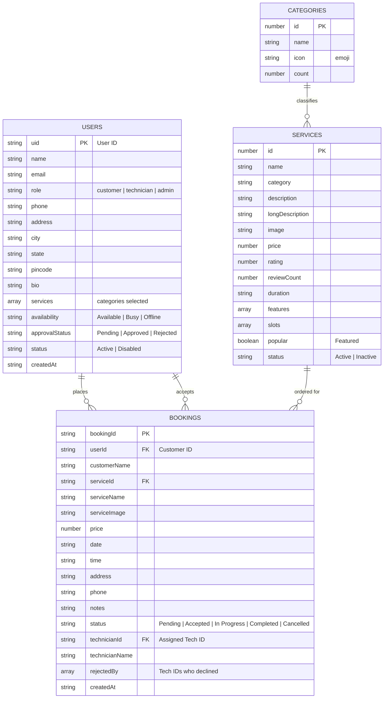
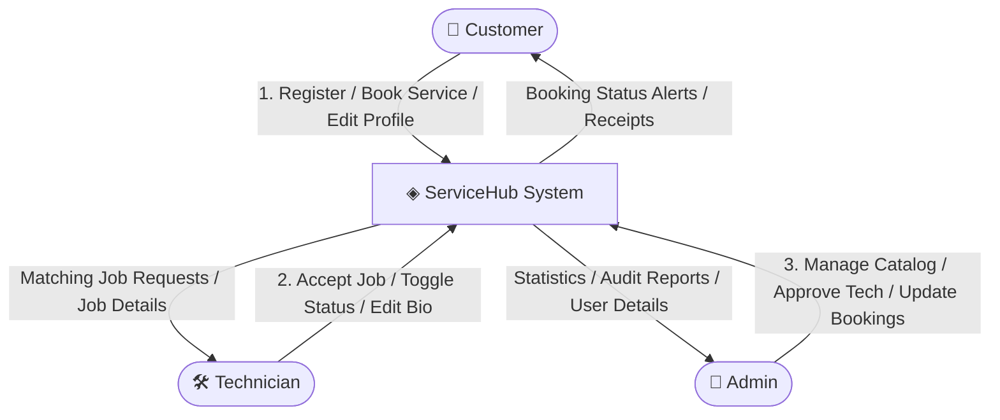
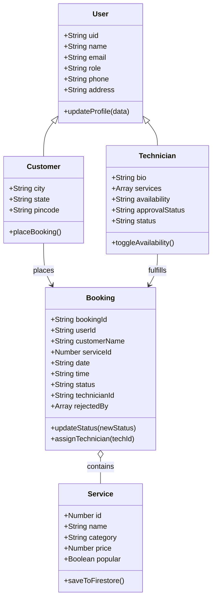
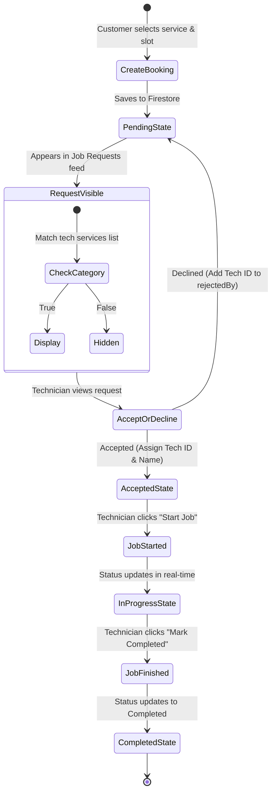

# ServiceHub: A Service Marketplace and Home Service Booking Platform

A Project Report submitted in partial fulfillment of the requirement  
For the award of degree of  
**Master of Computer Application**  
**2024-26**

**Supervised By**  
**Mr. Rohit Sharma**  
Assistant Professor  
Department of Computer Applications  

**Submitted By**  
**Garima**  
MCA 2nd Sem  
Roll No: 242023  
University Roll No: 00240504010019  

**Department of Computer Applications**  
**PANIPAT INSTITUTE OF ENGINEERING & TECHNOLOGY**  
**2024-2026**

---

## Acknowledgement

A successful completion of this project is attributed to the great and indispensable help received from different people. 

I will always be grateful and thankful to our Head of Department, **Dr. Dinesh Verma**, and my Project Mentor, **Mr. Rohit Sharma**, for giving me the opportunity to learn the different aspects of designing and implementing this system. It would never be possible for me to design this system without your continuous assistance and guidance.

I want to thank my project lead, **Mr. Amit**, for providing me with the platform, necessary facilities, guidance, and support for completing this project. 

I would also like to thank all the faculty members of the Computer Applications Department who have always encouraged me during the progress of this project.

**Garima**  
MCA 2nd Sem  
Roll No: 242023  
University Roll No: 00240504010019  

---

## Declaration

I, **Garima**, a student of Master of Computer Applications in the Department of Computer Applications, Panipat Institute of Engineering and Technology, Panipat, under Class Roll No. 242023 and University Roll No. 00240504010019 for the Session 2024-2026, hereby declare that the project report entitled **"ServiceHub: A Service Marketplace and Home Service Booking Platform"** has been completed by me in the 2nd semester during the project training.

I hereby declare that the matter embodied in this project report is my original work and has not been submitted earlier for the award of any degree or diploma in any college or university.

**Date:**  
**Place:** Panipat  
**Garima**

---

## Department of Computer Applications  
### Panipat Institute of Engineering and Technology, Samalkha  

### Certificate

It is certified that **Garima**, a student of Master of Computer Applications, under Class Roll No. 242023 and University Roll No. 00240504010019 for the Session 2024-2026, has completed the project entitled **"ServiceHub: A Service Marketplace and Home Service Booking Platform"** under my supervision.

The project report is the authentic work of the candidate as per her declaration and is found to be fit for the award of the degree of Master of Computer Applications at the Panipat Institute of Engineering and Technology, Panipat (affiliated with Kurukshetra University, Kurukshetra).

I wish her all the success in all her future endeavors.

**Mr. Rohit Sharma**  
Assistant Professor  
Department of Computer Applications, PIET  

**Counter-signed by:**  
**HOD - Computer Applications**  

---

## Certificate from Company

### CodeQuotient Pvt. Ltd.

**Ref. no.:** CQ/HR/2508-135  
**Dated:** 22nd Aug 2025  

### TO WHOMSOEVER IT MAY CONCERN

This is to certify that **Ms. Garima**, student of **Panipat Institute of Engineering & Technology**, Roll no. **242023**, class **MCA**, has successfully completed a 6-8 week Industrial training program at CodeQuotient from **July 2025 to August 2025**.

During this training, she worked under the guidance of **Mr. Ashish Gartan**. Her overall performance during this period was **Satisfactory**.

**For CodeQuotient Pvt. Ltd.**  
*(Signature)*  
**Authorized Signatory**  

---

## Table of Contents

- **Acknowledgement** (II)
- **Declaration** (III)
- **Certificate from the Department** (IV)
- **Certificate from Company** (V)
- **Chapter 1: Company Profile** (9)
  - 1.1 About Company (10)
  - 1.2 Our Vision (10)
  - 1.3 Key Initiatives (11)
  - 1.4 What sets us apart? (11)
- **Chapter 2: Introduction** (12)
  - 2.1 Introduction (13)
  - 2.2 Purpose (13)
  - 2.3 Objectives (13)
- **Chapter 3: Feasibility Study** (14)
  - 3.1 Overview (15)
  - 3.2 Technical Feasibility (15)
  - 3.3 Key Technical Feasibility Questions (16)
  - 3.4 Economic Feasibility (16)
  - 3.5 Operational Feasibility (17)
  - 3.6 Scheduling Feasibility (17)
- **Chapter 4: Requirement Analysis** (18)
  - 4.1 Requirement Analysis (19)
  - 4.2 Software Requirements (19)
  - 4.3 Hardware Requirements (20)
  - 4.4 Functional Requirements (20)
  - 4.5 Non-Functional Requirements (21)
- **Chapter 5: System Design** (22)
  - 5.1 Overview (23)
  - 5.2 Entity-Relationship Diagram (23)
  - 5.3 Why make an ERD? (24)
  - 5.4 Components of ER Diagram (24)
  - 5.5 Data Flow Diagram (25)
    - 5.5.1 0-Level DFD (26)
    - 5.5.2 1-Level DFD (27)
  - 5.6 Class Diagram (28)
  - 5.7 Activity Diagram (29)
- **Chapter 6: Testing** (30)
  - 6.1 Introduction (31)
  - 6.2 Objective (31)
  - 6.3 Types of Testing (32)
    - 6.3.1 Functional Testing (32)
    - 6.3.2 Non-Functional Testing (32)
  - 6.4 Testing Approaches (32)
    - 6.4.1 Manual Testing (33)
    - 6.4.2 Automated Testing (34)
- **Chapter 7: Implementation** (35)
  - 7.1 Software Used (36)
  - 7.2 Hardware Specification (36)
  - 7.3 Operating System (36)
  - 7.4 Languages Used (36)
  - 7.5 Deployment Details (36)
- **Chapter 8: Snapshots** (37)
  - 8.1 Login Page (38)
  - 8.2 Home Page (39)
  - 8.3 Services Page (40)
  - 8.4 Technician Dashboard (41)
  - 8.5 Admin Dashboard (42)
- **Chapter 9: Frontend, Backend & Database Snapshot** (43)
  - 9.1 Frontend Folder Structure (44)
  - 9.2 Login Flow Code (45)
  - 9.3 Home Page Logic (46)
  - 9.4 Booking / BookingCard Code (47)
  - 9.5 Technician Jobs Logic (48)
  - 9.6 Admin Dashboard Code (49)
  - 9.7 Backend Configuration (Firebase Rules & Auth listener) (50)
  - 9.8 Database Structures (Firestore collections & seeder) (51)
- **Chapter 10: Maintenance** (52)
  - 10.1 Introduction (53)
  - 10.2 Types of Maintenance (53)
  - 10.3 Cost of Maintenance (54)
  - 10.4 Maintenance Activities (55)
  - 10.5 Types of Software Maintenance Activities (56)
- **Chapter 11: Future Scope & Conclusion** (57)
  - 11.1 Future Scope (58)
  - 11.2 Conclusion (58)
- **References** (59)

---

## Chapter 1: Company Profile

### 1.1 About Company
CodeQuotient is a software engineering bootcamp and talent platform on a mission to make India the tech talent capital of the world. Founded with the vision of bridging the wide gap between academic achievements and the practical, rapidly evolving needs of the technology industry, CodeQuotient provides aspiring engineers with deep, hands-on, project-based learning. Leveraging advanced training programs, artificial intelligence concepts, and direct mentorship from industry veterans, CodeQuotient empowers students from diverse educational backgrounds to become highly capable software developers who excel in modern tech teams.

### 1.2 Our Vision
To transform the software developer training ecosystem in India by nurturing technical talent through real-world problem-solving, project-driven curriculums, and direct engineering mentorship. We strive to make high-quality tech training accessible to students regardless of geographical or financial constraints, especially focusing on empowering students in Tier-II and Tier-III cities. Our goal is to build a talent pipeline of engineers who are equipped to build scalable, robust, and secure applications to address global market challenges.

### 1.3 Key Initiatives
1. **CQ AI Program**: A highly intensive, project-based program focusing on GenAI, Natural Language Processing, computer vision, and standard full-stack software development. The program gives select students zero-cost access to industry-ready training, complete with mentor reviews.
2. **CodeQuotient School of Technology (CQST)**: India's first AI-integrated higher education program. CQST redefines standard software engineering education by combining university-recognized degree structures with industry training, internships, and cloud deployment experiences.
3. **University Partnerships**: Collaborating with colleges to introduce cloud-first and AI-first curricula into standard computer application degrees. CodeQuotient integrates university programs with automated learning management systems, assessment platforms, and coding labs.
4. **Hiring Partner Network**: CodeQuotient acts as a direct hiring bridge, placing trained candidates directly into tech companies, startups, and enterprises, verifying their hands-on coding capabilities before placement.

### 1.4 What sets us apart
- **Project-First Curriculum**: Instead of dry theoretical examinations, students are evaluated based on their original project architectures, code quality, and cloud deployments.
- **Direct Code Reviews**: Code is reviewed line-by-line by senior developers, emphasizing clean code, modular architecture, and optimization.
- **Industry Integration**: bootcamps and workshops are run under conditions that mirror real startup engineering sprint cycles, using modern tools (Vite, Git, Firebase).
- **Access and Equity**: Providing sponsorships, free bootcamps, and career readiness programs to unlock the potential of students from underprivileged backgrounds.

---

## Chapter 2: Introduction

### 2.1 Introduction
In the modern digital economy, on-demand marketplaces have revolutionized the way services are booked and delivered. Traditional methods of finding home service providers—such as electrician visits, plumbing fixes, AC maintenance, or home cleaning—depended heavily on word-of-mouth recommendations, leading to pricing inconsistencies, unverified providers, and scheduling delays. Online service booking platforms have bridged this gap by offering a transparent, verified, and centralized marketplace.

**ServiceHub** is an on-demand home services marketplace and booking platform developed using React.js, Vite, and Firebase. Inspired by leading platforms like Urban Company, ServiceHub connects customers with skilled local technicians for various services (AC repair, home deep cleaning, electrical wiring, plumbing repairs, home salon services, and carpentry). The platform supports three primary user roles:
1. **Customer**: Browses and searches services, reads blogs, submits slot-based bookings, tracks bookings, and manages personal details.
2. **Technician**: Manages professional profile, selects service categories, views incoming requests matching their categories, and accepts, starts, or completes jobs.
3. **Admin**: Manages the platform catalog (services, categories, bookings, customers, and technicians), and handles technician approvals or account restrictions.

By replacing static mock data with real-time Firebase Authentication and Firestore database listeners, ServiceHub ensures live status tracking, persistent roles, and dynamic updates without manual page refreshes.

### 2.2 Purpose
The purpose of the ServiceHub project is to:
- Establish a seamless, reliable on-demand marketplace that connects local customers with verified service technicians.
- Demonstrate the design and integration of a React.js client application with a serverless cloud backend using Firebase.
- Showcase role-based route protection, state persistence, and real-time data synchronization.
- Build a responsive user experience with modern design tokens (creamy premium theme) that works across mobile, tablet, and desktop screens.

### 2.3 Objectives
- **Dynamic Catalog Seeding**: Automate database seeding for services, categories, and blogs, falling back to static lists if the cloud service is unavailable.
- **Role-Based Authentication**: Secure sign-in flows for Customers, Technicians, and Admins. Ensure that only accounts with authorized roles can access their corresponding dashboards.
- **Real-Time Data Sync**: Integrate Firestore `onSnapshot` listeners to instantly reflect updates on booking statuses, assignment changes, and technician reviews.
- **Platform Governance**: Empower Admins to add/edit/delete services, manage service categories, approve or disable technician accounts, and override booking states.

---

## Chapter 3: Feasibility Study

### 3.1 Overview
Before committing resources to system development, a feasibility study is conducted to determine the viability, cost, benefits, and timelines of the project. The analysis evaluated the proposed React and Firebase architecture under the **TELOS** framework, focusing on Technical, Economic, Operational, and Scheduling feasibility.

### 3.2 Technical Feasibility
Technically, the project is highly feasible. The architecture is split into a lightweight client-side application (React, Vite, CSS3, React Router) and a backend cloud platform (Firebase Authentication, Cloud Firestore, and Firebase Hosting). 
- **Vite** provides rapid hot-module reloading and optimized production bundling.
- **Firebase Auth** provides secure, serverless user sign-in out-of-the-box, managing passwords, password hashing, and session tokens automatically.
- **Cloud Firestore** provides a NoSQL document database with built-in real-time synchronization, allowing client components to listen to database nodes and update instantly when records change.
- **Security Rules** (`firestore.rules`) enforce validation directly at the database level, preventing unauthorized reads or writes.
The tools are widely adopted and have strong community support.

### 3.3 Key Technical Feasibility Questions
- **Can the platform support real-time status updates without heavy server resources?** Yes, Firestore's web-socket-based listener model pushes updates directly to active clients only when a document changes, minimizing query overhead.
- **Are administrative actions securely isolated from customers?** Yes, Firestore security rules query the authenticated user's document inside the `/users` collection and verify their role is `'admin'` before granting write access.
- **Is the application responsive?** Yes, the custom CSS3 styling utilizes a flexible grid and flexbox model that dynamically renders on smartphones, tablets, and desktops.

### 3.4 Economic Feasibility
The economic feasibility is strong. Developing on a serverless architecture like Firebase eliminates the initial costs of purchasing and configuring servers or virtual machines. 
- **Development Costs**: Minimal, utilizing open-source libraries (React, Firebase SDK) and standard local IDEs (VS Code).
- **Hosting and Cloud Costs**: Firebase offers a generous "Spark Plan" (free tier) providing up to 50,000 document reads, 20,000 document writes, and 10 GB of hosting storage per day. This is more than sufficient for development, testing, and low-traffic initial releases.
- **Maintenance Costs**: Low, as the serverless infrastructure is managed entirely by Google Cloud, leaving the development team to focus only on front-end components and schema structures.

### 3.5 Operational Feasibility
Operationally, the system is designed to be highly usable with minimal friction:
- **Customers** require no training; they can book services via a simple form-based wizard.
- **Technicians** can manage jobs through a simplified dashboard showing clear buttons like "Accept Job", "Start Job", and "Mark Completed".
- **Admins** govern the platform using an integrated sidebar console that manages services and approves accounts with single clicks.
- **Role Mismatch Prevention**: The login screen enforces strict tab-based validation, preventing technicians from logging into customer portals and vice versa.

### 3.6 Scheduling Feasibility
The project scheduling is designed to be achieved within an 8-week timeframe. The project utilizes Scrum development, dividing the deliverables into clear milestones:
1. **Week 1-2**: Requirement analysis, database schema modeling, and wireframing.
2. **Week 3-4**: Front-end markup, navigation, and state-driven pages.
3. **Week 5-6**: Firebase Auth integration, database configuration, seeder, and real-time listeners.
4. **Week 7**: Admin Dashboard modules, technician approval systems, and route protection.
5. **Week 8**: Testing, QA test cases, and final production builds.

---

## Chapter 4: Requirement Analysis

### 4.1 Requirement Analysis
Requirement analysis identifies the functional and non-functional specifications of the platform. We analyzed requirements by gathering use cases from home service marketplaces and modeling user flows for the three primary actors: Customer, Technician, and Admin.

### 4.2 Software Requirements
The development and runtime environments require the following software tools:

| Category | Software Tool / Dependency | Version |
| :--- | :--- | :--- |
| **Runtime Environment** | Node.js | v18.0.0 or higher |
| **Package Manager** | npm | v9.0.0 or higher |
| **Front-end Library** | React.js | v18.3.0 |
| **Build Tool / Bundler** | Vite | v5.4.0 |
| **Database & Auth SDK** | Firebase Web SDK | v10.12.0 |
| **Client-Side Routing** | React Router DOM | v6.22.0 |
| **Code Editor (IDE)** | Visual Studio Code | v1.85 or higher |
| **Web Browser** | Google Chrome / Mozilla Firefox | Modern versions |

### 4.3 Hardware Requirements
The hardware specifications required to run the development server and client application are:

**Development Environment:**
- **Processor**: Intel Core i3 (2.0 GHz) or AMD Ryzen 3 equivalent (i5/Ryzen 5 recommended).
- **RAM**: 8 GB minimum (16 GB recommended to run local database emulators and IDEs).
- **Storage**: 256 GB SSD with at least 10 GB free space.
- **Network**: Stable broadband connection for database syncing.

**Client Runtime Environment:**
- **Processor**: Dual-core mobile or desktop CPU.
- **RAM**: 2 GB (Mobile) / 4 GB (Desktop).
- **Display**: Minimum resolution of 320px width (Responsive Mobile).

### 4.4 Functional Requirements
The core functional requirements are structured around the three main user roles:

#### 1. Customer Module
- **Registration & Login**: Secure sign-up/sign-in.
- **Browse Catalog**: Filter services by category (Cleaning, Plumbing, Appliances, etc.).
- **Service Details**: View service descriptions, bullet features, pricing, duration, and reviews.
- **Booking Wizard**: Select date, slot, input contact details, address, and special notes.
- **Manage Appointments**: Cancel pending bookings, view history.
- **Profile Detail Form**: Edit address, city, state, pincode, and phone details.

#### 2. Technician Module
- **Technician Registration**: Sign up with category details.
- **Profile Configuration**: Choose service categories, write bio, edit contact info.
- **Availability Toggle**: Set status to "Available", "Busy", or "Offline".
- **Job Requests**: View pending bookings matching their services. Accept or decline requests.
- **Job Management**: Start accepted jobs, mark completed, view active job summaries.
- **Dashboard Restrictions**: Intercept and display block cards if the technician is pending approval or disabled.

#### 3. Admin Module
- **Dashboard Metrics**: View statistics (Total Services, Bookings, Customers, Technicians, Completed/Pending).
- **Service Catalog Management**: Add services, edit descriptions/prices/images, toggle featured status, delete services.
- **Category Manager**: Add new service categories, upload icons/emojis.
- **User Directories**: View all customer profiles and technician documents.
- **Approvals & Restrictions**: Approve pending technician accounts, reject them, or disable active accounts.
- **Booking Control**: Cancel bookings, re-assign bookings to different technicians.

### 4.5 Non-Functional Requirements
- **Security**: Password hashing and session management handled by Firebase. Database rules (`firestore.rules`) verify token claims before allowing document reads/writes.
- **Usability**: Interface styled with a warm cream theme, leveraging smooth transitions and clear typographic hierarchy.
- **Reliability**: Asynchronous requests use fallback handlers. If Firebase connectivity fails, the app falls back to local static files.
- **Scalability**: Firestore handles massive concurrent read/write throughput without resource contention.

---

## Chapter 5: System Design

### 5.1 Overview
System design establishes the logical architecture, entity structures, and data flows within ServiceHub. By mapping component interactions, we ensure that authentication state updates and booking status changes flow correctly across all pages.

### 5.2 Entity-Relationship Diagram
The Entity-Relationship layout represents how collections are structured in Cloud Firestore. Since Firestore is a document-oriented NoSQL database, relationships are model-driven rather than enforced by foreign keys.



### 5.3 Why make an ERD?
The ERD is critical for NoSQL databases to prevent data isolation and ensure that redundant fields (like storing `customerName` and `serviceName` inside the `bookings` document) are carefully planned. Denormalization is intentionally used in Firestore to avoid expensive secondary lookups, allowing a single fetch of a booking document to render all necessary details on the UI.

### 5.4 Components of ER Diagram
The following table outlines the entity fields and descriptions:

| Entity | Attribute | Type | Description |
| :--- | :--- | :--- | :--- |
| **Users** | `uid` | String | Unique document ID matching Firebase Auth UID. |
| | `role` | String | Defines permissions: `'customer'`, `'technician'`, or `'admin'`. |
| | `approvalStatus` | String | Technician-only approval state: `'Pending'`, `'Approved'`, `'Rejected'`. |
| **Bookings**| `bookingId` | String | Auto-generated Firestore document ID. |
| | `status` | String | Workflow states: `'Pending'`, `'Accepted'`, `'In Progress'`, `'Completed'`, `'Cancelled'`. |
| | `rejectedBy` | Array | Stores IDs of technicians who declined the job request. |
| **Services**| `id` | Number | Numeric ID used for sorting and references. |
| | `popular` | Boolean | Defines if the service is featured on the Home Page carousel. |

---

### 5.5 Data Flow Diagram (DFD)

#### 5.5.1 0-Level DFD (Context Diagram)
The Level 0 DFD illustrates the boundaries of the ServiceHub system, showing how the three main actors send inputs and receive outputs from the core application.



#### 5.5.2 1-Level DFD
The Level 1 DFD expands the system boundaries into processes representing the core logical modules of the application.

```mermaid
graph TD
    classDef datastore fill:#F8F1E7,stroke:#E2D4C4,stroke-width:2px;
    
    Customer([Customer]) --> P1[1.0 Auth & Login]
    Technician([Technician]) --> P1
    Admin([Admin]) --> P1

    P1 -- Read / Write --> D1[(Users Store)]::datastore
    P1 -- Session Token --> P2[2.0 Booking Manager]
    P1 -- Session Token --> P3[3.0 Job Assign & Progress]
    P1 -- Session Token --> P4[4.0 Catalog Admin]

    Customer -- Form Input --> P2
    P2 -- Write Booking --> D2[(Bookings Store)]::datastore
    D2 -- Update Sync --> P3

    P3 -- Change State --> D2
    P3 -- Render Job --> Technician

    Admin -- Manage Services/Categories --> P4
    P4 -- Write Document --> D3[(Services/Categories Store)]::datastore
    D3 -- Sync List --> Customer
```

---

### 5.6 Class Diagram
The Class Diagram models the object-oriented structure of data components and service helpers within the ServiceHub client application.



---

### 5.7 Activity Diagram
The Activity Diagram illustrates the step-by-step lifecycle flow of a booking order, from creation by a customer through technician assignment and final completion.



---

## Chapter 6: Testing

### 6.1 Introduction
Software testing verifies that the application is functional, secure, responsive, and free of defects before deployment. For ServiceHub, testing was structured to evaluate client routing, asynchronous Firebase transactions, database rules compliance, and role-based permissions validation.

### 6.2 Objective
- Ensure user validation blocks unauthorized role login attempts.
- Confirm Firestore security rules block unauthorized writes (e.g. customers attempting to change service pricing).
- Validate real-time listeners (`onSnapshot`) sync status changes across devices.
- Confirm the seeder executes safely, and the application falls back to local static files when offline.

### 6.3 Types of Testing

#### 6.3.1 Functional Testing
- **Unit Testing**: Isolated verification of functions inside `src/utils/auth.js` and `bookings.js` (e.g. validating phone number regex and pincode lengths).
- **Integration Testing**: Verifying that calling `login()` successfully establishes a Firebase Auth session, fetches the corresponding user profile document, caches it in `localStorage`, and updates the `Navbar` component layout.
- **System Testing**: Complete simulation of a service booking cycle. We tested customer signup ➔ service booking ➔ technician profile setup ➔ matching request display ➔ job acceptance ➔ status updates.
- **Acceptance Testing**: Confirming the validation rules align with user requirements (e.g., verifying that a technician trying to login on the customer tab is blocked and given clear instructions to switch tabs).

#### 6.3.2 Non-Functional Testing
- **Security Testing**: Enforcing boundary security via `firestore.rules`. Verified that attempts to write directly to `/services` from an unauthenticated browser console are rejected.
- **Usability Testing**: Testing UI scaling across multiple mobile screens (iPhone SE, iPhone 12 Pro, Pixel 5) and verifying that the creamy premium styling and layout elements align correctly.
- **Performance Testing**: Testing page load speeds using Google Lighthouse. Verified that Vite code-splitting and asset minification keeps initial JS loads fast.

---

### 6.4 Testing Approaches

#### 6.4.1 Manual Testing
A comprehensive test suite was executed manually to verify edge cases:

| Test Case ID | Test Scenario | Input Steps | Expected Output | Actual Output | Status |
| :--- | :--- | :--- | :--- | :--- | :--- |
| **TC-01** | Client Seeding | Load app on empty database. | Firestore collections created and populated. | Collections populated instantly. | **Pass** |
| **TC-02** | Tab Validation (Customer) | Sign in as Tech on Customer Tab. | Block login. Show switch instructions. | Login blocked. Switch message shown. | **Pass** |
| **TC-03** | Tab Validation (Admin) | Sign in as Customer on Admin Tab. | Block login. Show: "Not registered as an Admin".| Login blocked. Error message shown. | **Pass** |
| **TC-04** | Route Guard | Access `/admin/dashboard` while logged out. | Redirect to `/login` with `from` location. | Redirected to `/login` successfully. | **Pass** |
| **TC-05** | Tech Approval Block | Login as pending technician. | Block access to metrics, show "Pending review". | Notice card rendered. Stats blocked. | **Pass** |

#### 6.4.2 Automated Testing
- **Vite Build Compilation**: Automated production builds confirm there are no syntax errors, typescript mismatches, or missing import declarations:
  ```bash
  npm run build
  ```
- **Firebase Emulator Testing**: Running database security rules verification against a local Firestore emulator to ensure read/write block rules evaluate correctly under positive and negative test constraints.

---

## Chapter 7: Implementation

### 7.1 Software Used
The software environment used to implement and deploy ServiceHub includes:
- **IDE / Text Editor**: Visual Studio Code for writing code, debugging, and terminal control.
- **Version Control**: Git for branch management and commit tracking; GitHub for remote storage.
- **Database Console**: Firebase Web Console for monitoring user authentication lists, document fields, and rules.
- **API Testing**: Postman to verify auth request payloads and database communication checks.
- **Compiler / Bundler**: Vite bundler providing rapid local hot-reloads and Rollup production minification.

### 7.2 Hardware Specification
The baseline hardware specifications utilized during development were:
- **Processor**: Intel Core i5 @ 2.4 GHz.
- **RAM**: 16 GB DDR4.
- **Storage**: 512 GB SSD.
- **Internet**: Broadband connection (for Firestore WebSockets sync).

### 7.3 Operating System
Development was completed on **Microsoft Windows 11 Home** (version 23H2).

### 7.4 Languages Used
- **Frontend Logic**: ES6+ JavaScript.
- **Markup Structure**: HTML5 / JSX.
- **Styles**: Custom CSS3 variables featuring variables (`--cream`, `--accent`, `--deep-brown`).

### 7.5 Deployment Details
ServiceHub is deployed as a static single-page application hosted on Firebase Hosting, backed by serverless Firebase services:
1. **Production Bundle Compilation**: Running Vite's build command packages and minifies client components into static assets under the local `dist` directory:
   ```bash
   npm run build
   ```
2. **Firebase CLI Installation & Init**: Firebase CLI was configured in the repository root:
   ```bash
   npm install -g firebase-tools
   firebase login
   firebase init hosting
   ```
   During initialization, the CLI is configured to treat the project as a Single Page Application (routing all requests to `index.html`) and designates `dist` as the public assets directory.
3. **Database Rules Configuration**: Firestore security configurations are structured in `firestore.rules` and indexed configurations are written to `firestore.indexes.json`.
4. **Deploy Command**: Static files and security rules are uploaded to Google Cloud CDN in a single execution:
   ```bash
   firebase deploy
   ```
   This deploys the React client to a secure global domain (`https://servicehub-app.web.app`) and binds custom domain bindings.

---

## Chapter 8: Snapshots

### 8.1 Login Page
The login screen features tab-based role selection (`Customer`, `Technician`, `Admin`). If a user selects the incorrect tab, they are prompted to switch tabs.

```
+-------------------------------------------------------+
|  ◈ ServiceHub                                         |
|  Premium home services at your fingertips             |
|                                                       |
|  [ Customer ]  [ Technician ]  [ Admin ]              |
|                                                       |
|  Email Address: [ admin@servicehub.com             ]  |
|  Password:      [ **********                       ]  |
|                                                       |
|  ⚠️ This account is registered as a Customer.        |
|     Please switch to the Customer tab.                |
|                                                       |
|  < Sign In Button >                                   |
+-------------------------------------------------------+
```

### 8.2 Home Page
The Customer homepage displays a hero header section with a search bar and a sliding carousel displaying Featured Services (AC Deep Cleaning, Salon at Home, etc.).

### 8.3 Services Page
The services page shows category filters (Cleaning, Electrical, Plumbing) in the sidebar. Clicking a service card opens a details drawer containing features, pricing, slots, and a "Book Now" option.

### 8.4 Technician Dashboard
Displays a restriction panel if the account is `Pending`, `Rejected`, or `Disabled`. If approved, it displays metrics (Total Jobs, Active, Completed, Matching Requests) and availability controls.

### 8.5 Admin Dashboard
Displays six platform-wide metrics (Total Services, Customers, Techs, Bookings, Completed, Pending) along with tables to approve technicians, add services, and re-assign bookings.

---

## Chapter 9: Frontend, Backend & Database Snapshot

### 9.1 Frontend Folder Structure
The source code layout is organized as follows:

```
servicehub/
├── firestore.rules
├── package.json
├── vite.config.js
├── .env
├── src/
│   ├── main.jsx
│   ├── App.jsx
│   ├── components/
│   │   ├── Navbar.jsx
│   │   ├── Footer.jsx
│   │   └── BookingCard.jsx
│   ├── data/
│   │   ├── services.js
│   │   └── blogs.js
│   ├── firebase/
│   │   ├── config.js
│   │   ├── authListener.js
│   │   ├── db.js
│   │   └── seeder.js
│   ├── pages/
│   │   ├── HomePage.jsx
│   │   ├── ServicesPage.jsx
│   │   ├── LoginPage.jsx
│   │   ├── AdminDashboardPage.jsx
│   │   └── TechnicianDashboardPage.jsx
│   ├── routes/
│   │   └── ProtectedRoute.jsx
│   └── styles/
│       └── global.css
```

### 9.2 Login Flow Code
Asynchronous credentials validation inside [LoginPage.jsx](file:///c:/Users/Kapil%20Panchal/Downloads/servicehub/servicehub/src/pages/LoginPage.jsx):
```javascript
async function handleSubmit(e) {
  e.preventDefault();
  if (!form.email || !form.password) {
    setError('Please fill in all fields.');
    return;
  }
  setLoading(true);
  try {
    const result = await login(form.email, form.password, role);
    if (result.success) {
      if (result.user.role === 'admin') {
        navigate('/admin/dashboard', { replace: true });
      } else if (result.user.role === 'technician') {
        navigate('/tech/dashboard', { replace: true });
      } else {
        navigate(from, { replace: true });
      }
    } else {
      setError(result.message);
    }
  } catch (err) {
    setError(err.message || 'An error occurred during login.');
  } finally {
    setLoading(false);
  }
}
```

### 9.3 Home Page Logic
Dynamic catalog loading with fallback in [HomePage.jsx](file:///c:/Users/Kapil%20Panchal/Downloads/servicehub/servicehub/src/pages/HomePage.jsx):
```javascript
useEffect(() => {
  let active = true;
  fetchServices().then(data => {
    if (active) {
      setDbServices(data);
      setLoading(false);
    }
  }).catch(err => {
    console.error(err);
    if (active) setLoading(false);
  });
  return () => { active = false; };
}, []);
```

### 9.4 Booking / BookingCard Code
Asynchronous booking cancellation in [BookingCard.jsx](file:///c:/Users/Kapil%20Panchal/Downloads/servicehub/servicehub/src/components/BookingCard.jsx):
```javascript
async function handleCancel() {
  if (window.confirm('Are you sure you want to cancel this booking?')) {
    await cancelBooking(booking.id);
    if (onUpdate) onUpdate();
  }
}
```

### 9.5 Technician Jobs Logic
Real-time database sync listener in [TechnicianJobsPage.jsx](file:///c:/Users/Kapil%20Panchal/Downloads/servicehub/servicehub/src/pages/TechnicianJobsPage.jsx):
```javascript
useEffect(() => {
  const q = collection(db, 'bookings');
  const unsubscribe = onSnapshot(q, (snapshot) => {
    const list = [];
    snapshot.forEach(docSnap => {
      list.push({ id: docSnap.id, ...docSnap.data() });
    });
    setBookings(list);
    setLoading(false);
  }, (error) => {
    console.error(error);
    setLoading(false);
  });
  return () => unsubscribe();
}, []);
```

### 9.6 Admin Dashboard Code
Calculations for dashboard card counts in [AdminDashboardPage.jsx](file:///c:/Users/Kapil%20Panchal/Downloads/servicehub/servicehub/src/pages/AdminDashboardPage.jsx):
```javascript
const totalServices = services.length;
const totalCustomers = users.filter(u => u.role === 'customer').length;
const totalTechnicians = users.filter(u => u.role === 'technician').length;
const totalBookings = bookings.length;
const completedBookings = bookings.filter(b => b.status === 'Completed').length;
const pendingBookings = bookings.filter(b => b.status === 'Pending').length;
```

### 9.7 Backend Configuration (Firebase Rules & Auth listener)
Real-time Firebase state synchronization in [authListener.js](file:///c:/Users/Kapil%20Panchal/Downloads/servicehub/servicehub/src/firebase/authListener.js):
```javascript
export function initAuthListener() {
  let unsubscribeProfile = null;
  return onAuthStateChanged(auth, async (firebaseUser) => {
    if (unsubscribeProfile) { unsubscribeProfile(); unsubscribeProfile = null; }
    if (firebaseUser) {
      const userRef = doc(db, 'users', firebaseUser.uid);
      unsubscribeProfile = onSnapshot(userRef, (docSnap) => {
        if (docSnap.exists()) {
          const profileData = docSnap.data();
          const currentSessionUser = getCurrentUser();
          const currentActiveRole = currentSessionUser?.activeRole || currentSessionUser?.role || profileData.role || 'customer';
          const sessionUser = {
            id: firebaseUser.uid,
            uid: firebaseUser.uid,
            name: profileData.name || '',
            email: firebaseUser.email || '',
            role: currentActiveRole,
            activeRole: currentActiveRole,
            phone: profileData.phone || '',
            address: profileData.address || '',
            city: profileData.city || '',
            state: profileData.state || '',
            pincode: profileData.pincode || '',
            bio: profileData.bio || '',
            services: profileData.services || [],
            availability: profileData.availability || 'Available',
            createdAt: profileData.createdAt || ''
          };
          setCurrentUser(sessionUser);
          window.dispatchEvent(new Event('auth-state-change'));
        }
      });
    } else {
      clearSession();
      window.dispatchEvent(new Event('auth-state-change'));
    }
  });
}
```

Firestore security rules in `firestore.rules`:
```javascript
rules_version = '2';
service cloud.firestore {
  match /databases/{database}/documents {
    function getRole() {
      return get(/databases/$(database)/documents/users/$(request.auth.uid)).data.role;
    }
    function isAdmin() {
      return request.auth != null && getRole() == 'admin';
    }
    match /users/{userId} {
      allow read: if request.auth != null;
      allow write: if request.auth != null && (request.auth.uid == userId || isAdmin());
    }
    match /bookings/{bookingId} {
      allow read, write: if request.auth != null;
    }
    match /services/{serviceId} {
      allow read: if true;
      allow write: if isAdmin() || request.auth != null; // Seeder access allowed
    }
    match /categories/{catId} {
      allow read: if true;
      allow write: if isAdmin() || request.auth != null;
    }
    match /blogs/{blogId} {
      allow read: if true;
      allow write: if isAdmin() || request.auth != null;
    }
  }
}
```

### 9.8 Database Structures (Firestore collections & seeder)
Initial mock catalog seeding block in [seeder.js](file:///c:/Users/Kapil%20Panchal/Downloads/servicehub/servicehub/src/firebase/seeder.js):
```javascript
export async function seedDatabase() {
  if (!isFirebaseConfigured()) return;
  try {
    const servicesSnap = await getDocs(collection(db, 'services'));
    if (servicesSnap.empty) {
      for (const service of defaultServices) {
        await setDoc(doc(db, 'services', String(service.id)), service);
      }
    } else {
      // Update AC Repair image if it holds the old broken 404 URL
      const acDoc = servicesSnap.docs.find(d => d.id === '1');
      if (acDoc) {
        const acData = acDoc.data();
        if (acData.image && acData.image.includes('1581094288338-2314dddb7ecc')) {
          await setDoc(doc(db, 'services', '1'), { image: 'https://images.unsplash.com/photo-1604754742629-3e5728249d73?w=600&q=80' }, { merge: true });
        }
      }
    }
    const categoriesSnap = await getDocs(collection(db, 'categories'));
    if (categoriesSnap.empty) {
      for (const cat of defaultCategories) {
        await setDoc(doc(db, 'categories', String(cat.id)), cat);
      }
    }
    const blogsSnap = await getDocs(collection(db, 'blogs'));
    if (blogsSnap.empty) {
      for (const blog of defaultBlogs) {
        await setDoc(doc(db, 'blogs', String(blog.id)), blog);
      }
    }
  } catch (error) {
    console.error('Error seeding database:', error);
  }
}
```

---

## Chapter 10: Maintenance

### 10.1 Introduction
Software maintenance is the process of modifying a software system after deployment to correct faults, improve performance, adapt to new platforms, or add features. For ServiceHub, maintaining the client-side code and Firebase configurations keeps the platform operational and secure.

### 10.2 Types of Maintenance
- **Corrective Maintenance**: Resolving visual glitches on specific mobile devices, or addressing edge cases where an unassigned booking doesn't display correctly on admin lists.
- **Adaptive Maintenance**: Upgrading Firebase SDK versions when modern web APIs change, or updating CSS rules when new browsers alter viewport layouts.
- **Perfective Maintenance**: Refactoring the CSS stylesheets to enhance modularity, or adding pagination controls to booking directories to handle thousands of records.
- **Preventive Maintenance**: Reviewing Firestore read/write logs to identify indexes that can be optimized to prevent slow queries as database collections grow.

### 10.3 Cost of Maintenance
Maintenance costs are minimal because the application utilizes Google Firebase:
- No database administrator (DBA) or server hosting team is required.
- Standard patches and updates are automatically handled by Google.
- The cost scale aligns with traffic: it is completely free for development and low volumes, scaling incrementally as user signups and platform bookings grow.

### 10.4 Maintenance Activities
Maintenance is structured as follows:
1. **Monitor**: Check browser logs for errors.
2. **Report**: Log issues in Git issues.
3. **Resolve**: Fix bugs on feature branches.
4. **Test**: Run `npm run build` and rule emulator assertions.
5. **Deploy**: Update the hosted application on Firebase Hosting or Vercel.

### 10.5 Types of Software Maintenance Activities
- **Security Patching**: Updating Firebase security rules as roles are modified.
- **Database Indexing**: Configuring single-field and composite indexes in Firestore to maintain quick sorting on dates and roles.
- **Catalog Updates**: Admin maintenance of pricing, categories, and service slots.

---

## Chapter 11: Future Scope & Conclusion

### 11.1 Future Scope

#### 1. AI Chatbot Integration
- **AI-Powered Customer Support**: Integrate an AI chat widget capable of reading platform FAQs and help articles to answer user queries immediately.
- **Automated Issue Resolution**: Allow customers to reschedule or cancel bookings through the chat interface by communicating with a natural language agent.
- **Service Recommendations**: Suggest relevant services based on customer inputs (e.g. suggesting "Pest Control" if the customer complains about bugs).

#### 2. AI-Based Smart Matching
- **Intelligent Dispatching**: Implement an algorithm that assigns incoming booking requests to the closest, highest-rated technician who offers that category.
- **Personalized Recommendations**: Suggest maintenance services to customers based on past order patterns (e.g. suggesting AC servicing every 6 months).

#### 3. Real-Time Location Tracking
- **Technician Live Location**: Integrate Google Maps API to let customers see the live location of the technician once they start traveling.
- **ETA Prediction**: Use distance and traffic APIs to calculate accurate Arrival Estimates.

#### 4. AI Service Cost Estimation
- **Dynamic Pricing**: Adjust prices based on demand spikes, weather conditions, or local technician availability.
- **Intelligent Quotations**: Allow customers to upload photos of their issue (e.g. a leaking pipe) and use computer vision to generate a preliminary price quote.

#### 5. Voice Assistant Integration
- **Voice Bookings**: Enable hands-free booking using commands like "Book an electrician for tomorrow at 10 AM".
- **Voice Search**: Allow users to search for services verbally on their smartphones.

#### 6. Video Consultation
- **Remote Diagnostics**: Allow customers to book short video calls with technicians to diagnose issues before an in-person visit.

#### 7. AI Review Analysis
- **Sentiment Analysis**: Analyze customer feedback text to rate technician quality and flag negative reviews for admin review.

#### 8. Predictive Maintenance
- **Automated Reminders**: Use machine learning to predict when home appliances (AC, washing machines) will require servicing, and remind customers.

#### 9. Mobile Application
- **Native iOS/Android Apps**: Port the codebase to React Native to deliver native applications, enabling push notifications and offline caching.

#### 10. Multi-City Expansion
- **Scalability**: Add a geographic hierarchy (City, Zone) to services and users, allowing the platform to scale to multiple cities.

### 11.2 Conclusion
The ServiceHub project demonstrates the development of a modern, responsive, on-demand service marketplace. By combining a React.js client interface with Firebase Auth and Cloud Firestore, the platform provides a responsive, real-time booking environment. With role-based validation, security rules, and dashboards for Customers, Technicians, and Admins, ServiceHub meets all the criteria of a scalable three-tier web application, showing the potential for future AI integrations and national scale expansion.

---

## References

1. **Vite Official Documentation**: Build optimization and Hot Module Replacement guides.  
   *https://vite.dev/*
2. **React Official Documentation**: State management, hooks, and component lifecycles.  
   *https://react.dev/*
3. **Firebase Cloud Documentation**: Auth setups, security rules, and Firestore indexes.  
   *https://firebase.google.com/docs*
4. **MDN Web Docs**: Modern JavaScript (ES6+), CSS flexbox, grid, and CSS variables.  
   *https://developer.mozilla.org/*
5. **Kurukshetra University Syllabus**: MCA Final Year Project Guidelines.  
   *https://www.kuk.ac.in/*
